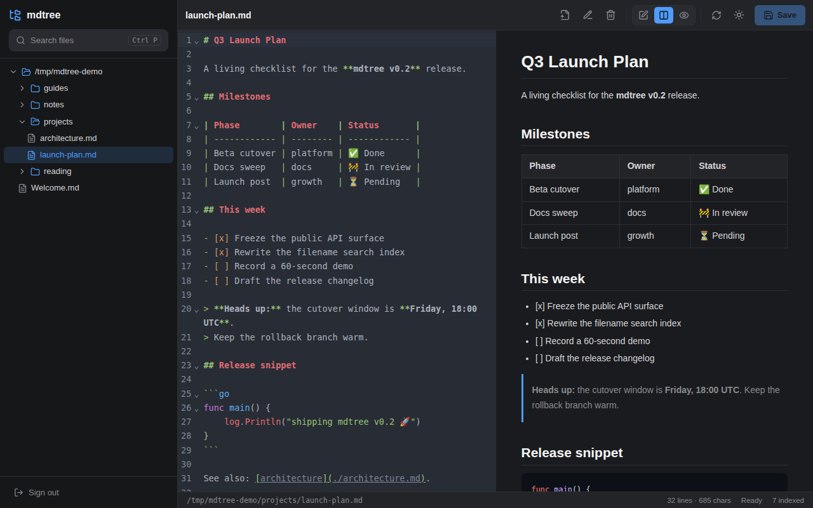
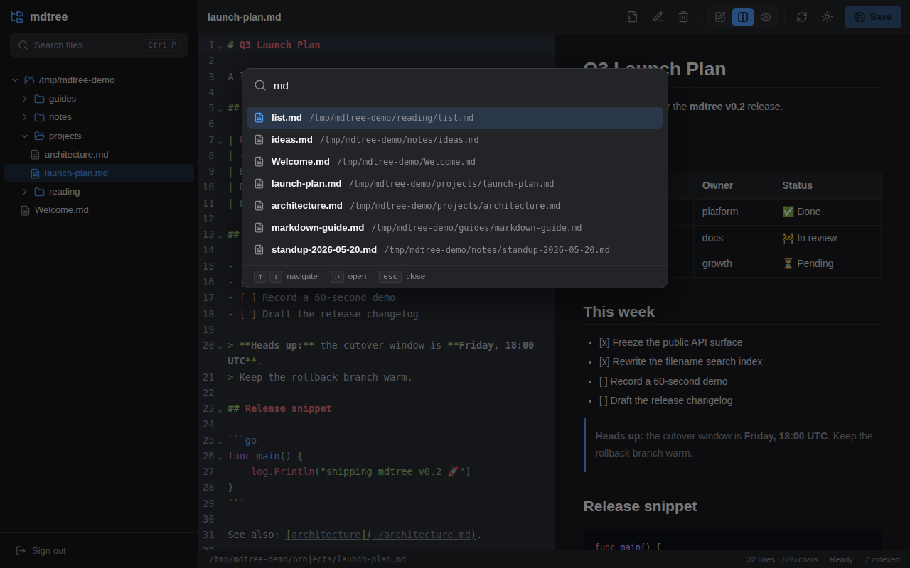
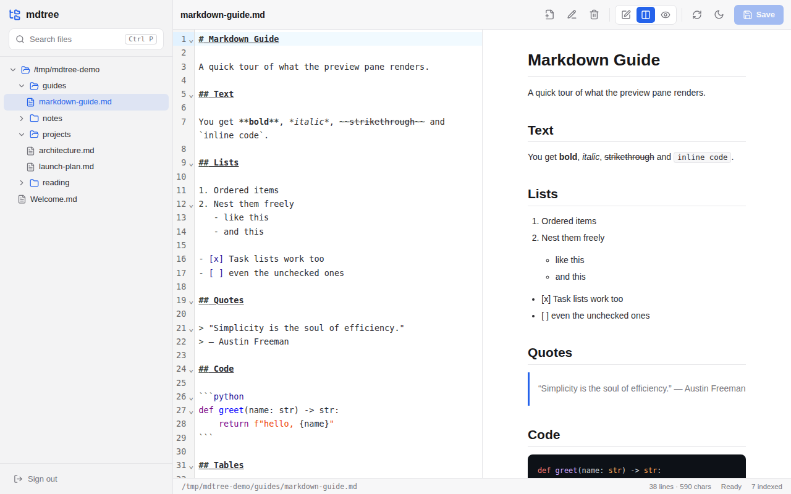

<div align="center">

# mdtree

**A self-hosted markdown browser & editor for your server.**

A file tree of *only* your markdown, a real editor with live preview, and
instant filename search — all behind a password, all in a single binary.

**English** · [简体中文](README.zh-CN.md)

[](https://github.com/SinlinLi/mdtree/actions/workflows/ci.yml)
[](LICENSE)
[](https://goreportcard.com/report/github.com/SinlinLi/mdtree)

</div>



## Why

You keep notes, docs and READMEs scattered across a server and want to edit
them quickly — without `ssh` + `vim`, and without syncing the whole tree to a
laptop. mdtree gives you one URL: a clean tree of just the markdown, a proper
editor with live preview, and `Ctrl-P` search across every `.md` file on the
box.

## Features

- **Markdown-only file tree** — directories for navigation, but only markdown
  files are listed. Loads lazily, so it stays fast even on a huge filesystem.
- **Browse & edit** — a CodeMirror 6 source editor with a live, sanitized
  preview. Edit-only, split, or preview-only view modes.
- **Indexed filename search** — an in-memory index of every markdown file,
  with fuzzy matching, surfaced as a `Ctrl`/`Cmd` + `P` command palette.
- **Full file management** — create, save, rename, delete files and create
  directories. Saves are atomic (write-temp-then-rename).
- **Authentication** — password login (bcrypt), HTTP-only session cookies,
  and login rate limiting. mdtree can reach the whole filesystem, so the
  password is the gate.
- **Single binary** — the React frontend is embedded with `go:embed`. Drop
  one file on the server, run it, done. No runtime dependencies.
- **Observable** — structured leveled logs (console + rotating files), a
  `/healthz` check, and a `/api/stats` metrics endpoint.
- **Light & dark themes**, with your choice remembered.

## Screenshots

| Filename search (`Ctrl-P`)             | Light theme                            |
| -------------------------------------- | -------------------------------------- |
|   |  |

## Quick start

Download or build a binary (see [Building](#building)), then:

```bash
# Generate a password hash.
./mdtree hash

# Create a config file.
cp config.example.yaml config.yaml
# ...paste the hash into config.yaml under auth.password_hash...

# Run it.
./mdtree --config config.yaml
```

Then open <http://localhost:8080>.

No config at all? `./mdtree` still runs — it browses `/`, binds to localhost,
and prints a one-time random password to the console.

Common flags:

```bash
./mdtree --root /srv/docs --port 9000 --log-level debug
```

## Building

Requirements: **Go 1.25+** and **Node.js 20+**.

```bash
git clone https://github.com/SinlinLi/mdtree.git
cd mdtree
./scripts/build.sh        # builds the frontend, then bin/mdtree
```

Or with `make`:

```bash
make build                # frontend + binary
make test                 # run the test suite
make dev                  # backend + Vite dev server with hot reload
```

## Configuration

mdtree reads, in increasing order of precedence: built-in defaults, a YAML
config file, `MDTREE_*` environment variables, then command-line flags. Every
option is documented in [`config.example.yaml`](config.example.yaml) and in
[`docs/configuration.md`](docs/configuration.md).

## Security

mdtree is designed to **edit any file the server process can reach** — that is
the point of the tool, and it is why authentication is mandatory. Before
exposing it beyond `localhost`, read [`docs/security.md`](docs/security.md):
run it as a dedicated least-privilege user, scope `root` if you can, and put
it behind an HTTPS reverse proxy.

## Documentation

- [Architecture](docs/architecture.md) — how the pieces fit together
- [Configuration](docs/configuration.md) — every option, env var and flag
- [API reference](docs/api.md) — the HTTP JSON API
- [Security model](docs/security.md) — threat model and hardening

## Contributing

Contributions are welcome — see [`CONTRIBUTING.md`](CONTRIBUTING.md).

## License

[MIT](LICENSE)
