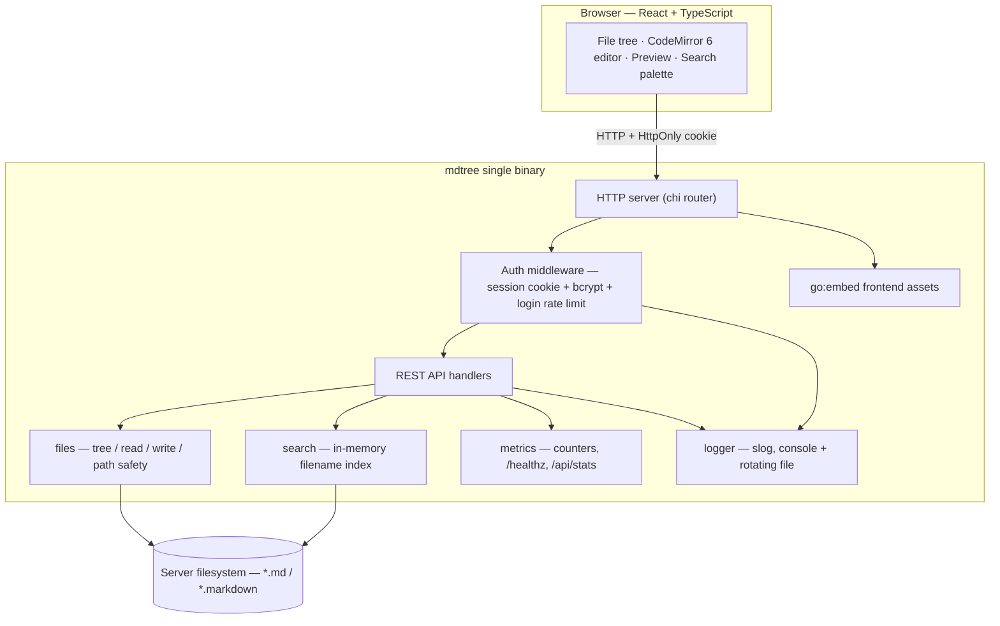
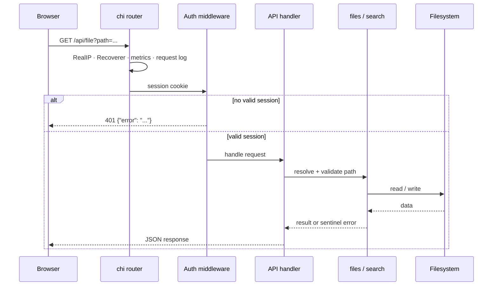

# Architecture

mdtree is a Go HTTP server with an embedded React single-page app. It compiles
to one binary with no runtime dependencies.

## Overview

## Packages

| Package             | Responsibility                                              |
| ------------------- | ----------------------------------------------------------- |
| `cmd/mdtree`        | Entry point: flags, the `hash` subcommand, process wiring   |
| `internal/config`   | Load + validate config (defaults < YAML < env < flags)      |
| `internal/logger`   | `slog` setup: leveled, console + rotating file, per-module  |
| `internal/auth`     | bcrypt hashing, session store, login rate limit, middleware |
| `internal/files`    | Root-confined path resolution, directory listing, file I/O  |
| `internal/search`   | In-memory markdown filename index and fuzzy ranking         |
| `internal/api`      | HTTP JSON handlers                                          |
| `internal/server`   | chi router, middleware chain, embedded-SPA serving          |
| `internal/metrics`  | In-process counters and the request-timing middleware       |
| `web/`              | React frontend; `web/embed.go` embeds `web/dist`            |

## Request lifecycle

Any request that is not `/healthz`, `/api/*`, or a static asset falls through
to the embedded SPA's `index.html`, so client-side navigation survives a page
refresh.

## Frontend

The frontend (`web/src`) is a React + TypeScript app built by Vite. CodeMirror 6
provides the markdown source editor; `markdown-it` renders the preview and
`DOMPurify` sanitizes it before it reaches the DOM (raw HTML in markdown is
disabled as well). `npm run build` emits `web/dist`, which `web/embed.go`
embeds into the binary via `go:embed`.

In development, the Vite dev server proxies `/api` to the Go backend, so the
frontend hot-reloads while talking to the real API (see `scripts/dev.sh`).

## Key design decisions

- **Single binary.** The frontend is embedded, so deployment is copy-and-run.
- **Lazy tree.** `GET /api/tree` returns one directory level at a time; the
  tree never walks the whole filesystem just to render.
- **Separate search index.** A background walk at startup builds an in-memory
  index so search is instant and does not touch disk per keystroke. Edits made
  through mdtree update the index incrementally; `POST /api/search/reindex`
  rebuilds it on demand.
- **Atomic writes.** Saves write to a temporary file in the target directory
  and `rename` it into place, so a reader never sees a half-written file.
- **Root confinement.** Every path is cleaned, made absolute, and checked to
  be inside the configured `root`; symlink escapes are rejected unless
  `follow_symlinks` is enabled.
